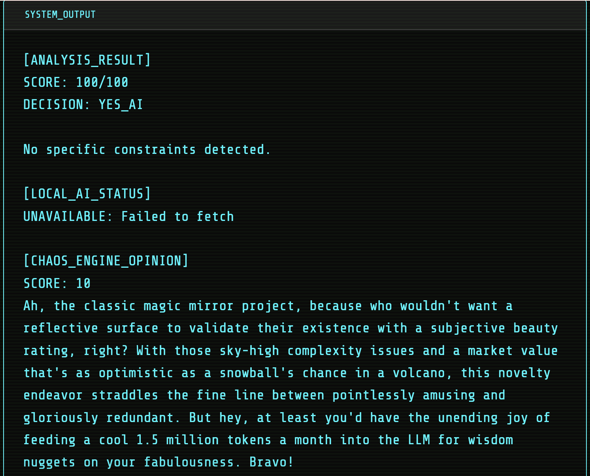
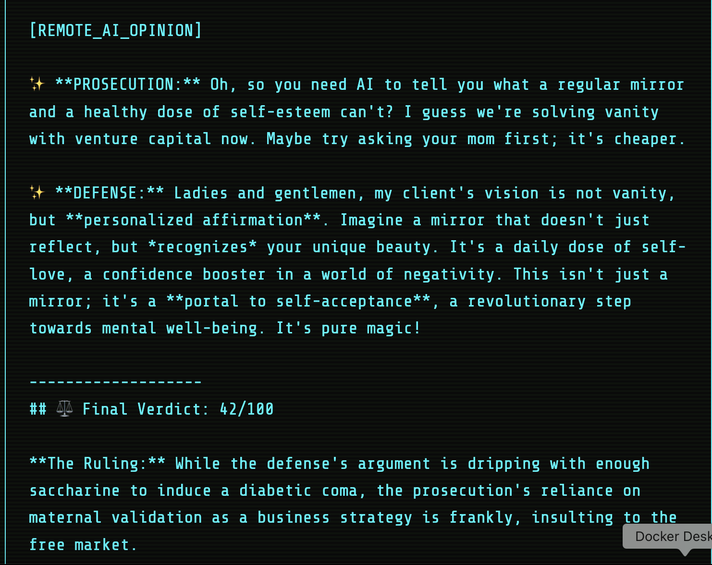

# ⚖️ The AI Courtroom: Skeptic Agent API

> **"Do you really need AI for that?"**

A ruthlessly efficient multi-agent system built for the Hackathon. It puts every project idea on trial to determine if it's a valid use of Artificial Intelligence or just overengineered hype.

---

##  How It Works
This API spins up **two parallel AI Agents** for every request:

*  **The Prosecutor:** Scans the idea against a database of "Boring Tech" (Excel, Regex, SQL) to prove AI is unnecessary.
*  **The Defense Attorney:** Argues for the "Magic," UX, and revolutionary potential of using AI.
*  **The Judge:** Weighs both arguments and delivers a final **0-100 Score** and a sarcastic verdict.

---

## API Connection (For Frontend Team)

The backend is live and hosted on **Hugging Face Spaces**.

**Base URL:**
https://www.google.com/url?sa=E&source=gmail&q=https://yitianhowcanthisnotavailable-ai-guarding.hf.space/invoke

###  How to Call the API (JavaScript/React)
Send a simple `POST` request with the user's idea in the JSON body.

```javascript
// Example Frontend Function
async function judgeIdea(userIdea) {
  const API_URL = "https://yitianhowcanthisnotavailable-ai-guarding.hf.space/invoke";

  try {
    const response = await fetch(API_URL, {
      method: "POST",
      headers: {
        "Content-Type": "application/json"
      },
      body: JSON.stringify({
        input: userIdea // e.g., "I want to build an AI toaster"
      })
    });

    const data = await response.json();

    // The full verdict (Prosecutor + Defense + Judge) is here:
    console.log(data.output);
    return data.output;

  } catch (error) {
    console.error("Error connecting to the Courtroom:", error);
    return "Error: Could not reach the Skeptic Agent.";
  }
}
```

## Tech Stack
Google Gemini 1.5 Pro (via LangChain)

FastAPI + Uvicorn (Async/Parallel Processing)

Hugging Face Spaces (Dockerized)

## Demo





---